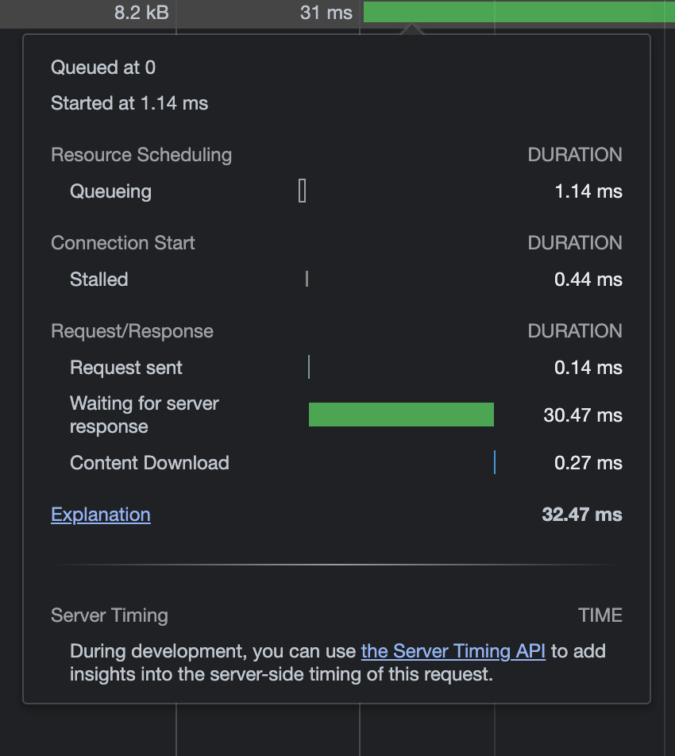

# Chapter 2 - Using assessment tools

This chapter covers tools and techniques to assess web perf. Most of the notes here are light given its just an overview of many tools/techniques - deeper dives will probably need other references

## Network related tools

### Google PageSpeed Insights

- [Google PageSpeed Insights](https://pagespeed.web.dev/) analyzes a website and gives tips on how to improve its performance and user experience.

### Google Analytics

- Google Analytics is a reporting tool that provides data on your site's vistors. All it takes for setup is passing a small bit of JS code in the site's HTML.

### Network Requests Inspection

- One of the crucial metrics for perf is known as __Time to First Byte (TTFB)__ - the amount of time it takes between the user's request for the web page and momemnt the first byte arrives.

- Causes of long TTFB may vary:
    - Poor network connection/conditions
    - Physical distance of server from user
    - Poor server performance
    - Backend application issues

- You can inspect this from Chrome's network tab (Waiting for server to respond). Just hover over the water fall

### Viewing HTTP request and response headers

- The request and response HTTP headers contain a few useful perf-related things
    - `Content-Encoding` response header tells you whether a resource is compressed by the web server

## Render Perf Auditing Tools

- Minimizing load time is a big concern, but another aspect of perf is __page's rendering speed__

- Initial rendering of a page is important, but it's also important that interactions with web pages after they render are smooth

## Understanding how browsers render web pages

- This is mostly a re-hash of the "How Browsers Work" notes at a high level

- Order of browser stuff:
    1. Parse HTML to create DOM
        - HTML is downloaded by web server -> parsed by browser to build DOM (hierarchical representation of the HTML document's structure)
    2. Parse CSS to create CSSOM
        - After DOM is built, browser parses CSS and creates CSSOM (similar to DOM except for CSS rules applied to the document)
    3. Lay out elements
        - DOM + CSSOM help create a __render tree__, which goes through a layout process where CSS rules are applied and elements are laid out on the page to create the UI
    4. Paint page
        - The cosmetic aspects of the page are applied from the CSS and media in the page. The output is converted into pixels (**rasterized**) and displayed on the screen.

## Google Chrome's Timeline tool

- The tool records loading, scripting, rendering and painting activity of a page.
    - Under `Performance` > Record to Profile then Stop. It will produce an icicle chart + pie chart with breakdown of activities

    - **Loading**: Network related events such as HTTP requests, but also includes parsing of HTML, CSS and image decoding
    - **Scripting**: JS related events. From DOM-specific activity to GC to site specific JS, etc
    - **Rendering**: Any events relating to page rendering. Includes applying CSS to the page HTML, events that cause re-rendering such as changes to the page HTML triggered by JS
    - **Painting**: Events related to drawing the layout to the screen, such as layer compositing and rasterization

- The icicle chart shows "tasks" that have occured during the profiling. The "tasks" show a isolated call stack that shows the things going on underneath the top level event, such as events being fired (eg.`*DOMContentLoaded` after HTML is parsed)

### Identifying Jank

- **Jank** is the effect of interactions and animations that stutter or otherwise fail to render smoothly. Even a page that loads quickly from the network is subject to the effects of jank if suboptimal programming techniques are used.

- Ultimate cause of jank: Too much CPU time consumed during a single **frame** (the amount of work the browser does in one FPS of display time. Work here being the activities described - loading, scripting, painting, rendering).
    - The optimal frame rate is typically 60 FPS, but not always possible on all devices.
    - Examples: Scripts firing too often, loading events that take too long, inefficient rendering or painting operations

- *** A common jank causer is usage of JS animation when CSS can handle the animation.
    - Eg. A simple linear animation likely doesnt require JS to animate it, so moving it over to CSS will handle the optimization for you using something like `transform: translate(...)`

### Marking points in the timeline with JS
