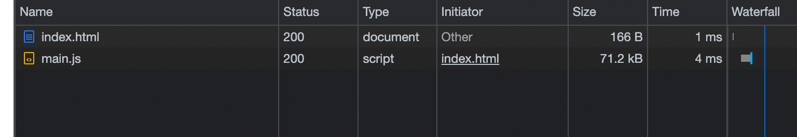

## Refs

- https://webpack.js.org/guides/getting-started/

- https://www.sitepoint.com/webpack-beginner-guide/

## Intro

- Webpack is a static module bundler for JS apps. When webpack processes your JS app, it interally builds a dependency graph from one or more "entry points" and combines every module your project needs into one or more bundles. These are your static assets to serve your client.

- webpack works similar to typescript - there is a raw "src" directory with all the JS and a "dist" folder where the bundled moudle(s) live.

example webpack.config.js:

```javascript
 const path = require('path');

 module.exports = {
   entry: {
     index: './src/index.js',
     print: './src/print.js',
   },
  plugins: [...],
   output: {
     filename: '[name].bundle.js',
     path: path.resolve(__dirname, 'dist'),
   },
 };
 ```

## Main Concepts

- `Entry`: the starting/entry point that webpack uses to build the dependency graph. It traverses the dependencies until no dependencies left out. The default is `./src.index.js`, but we can specify another or multiple in the config.

- `Output`: Where the bundle(s) are distributed. Default is `./dist/main.js` for the main bundle and `./dist` for the other generated files.

- `Loaders`: By default, webpack only understands JS and JSON. Loaders are used to process other file types. Loaders transform the source code of non-JS modules, allowing us to pre-process them before they're added to the dep. graph. Examples include transforming CoffeeScript to JS, inline images to data URLs, etc.

- `Plugins`: Handles what loaders can't. They provide options for asset management, bundle minization and optimization, etc.

- `Mode`: The build type (`development`, `prod` or `none`). Depending on the mode, webpack may use different built-in optimizations. Default is `production`. `none` means no default optimization options will be used.

## Example

- from the toy example in thid directory, we want to try out the three modes and compare the JS size

[A] `npm run raw`:
This is with mode = `none`


Stats:
- Size: 548kB
- LOC: 17,234

[B] `npm run dev`:
This is with mode = `development`

Surprisingly, dev has more bytes overall, although significantly less LOCs overall


Stats:
- Size: 568kB
- LOC: 132

[C] `npm run build`:
This is with mode = `production`




Stats:
- Size: 71.2kB
- LOC: 2

That difference!

## Other notes

### Modules

- `import`/`export` aren't natively supported by older browsers, so Webpack transpiles them for you. **Webpack does not alter any other code**. If you want additional support for other ES6+ features, use a transpiler like Babel instead.


